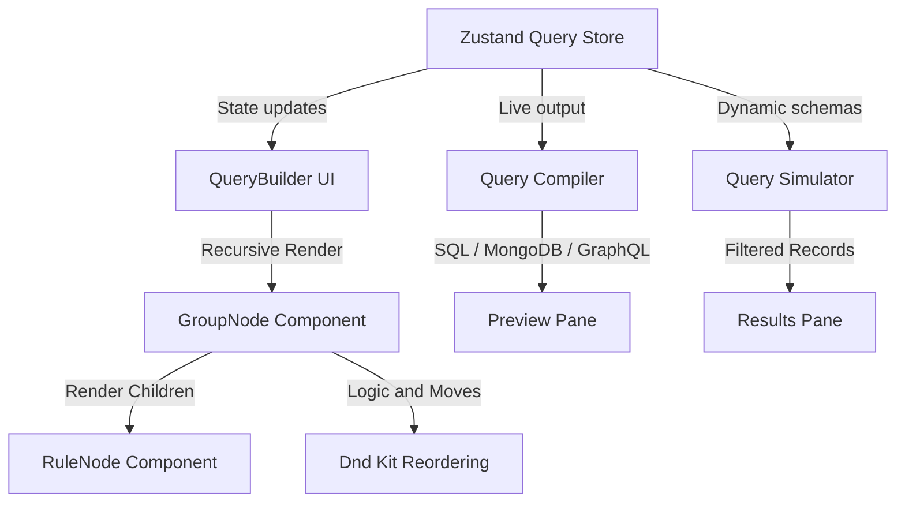

# QueryForge — Visual Query Builder

QueryForge is a high-performance, schema-driven visual query builder built with **Next.js 16**, **React 19**, **TypeScript**, **Zustand**, and **Tailwind CSS**. It allows developers and non-technical users alike to build complex database and API queries — generating **SQL**, **MongoDB**, and **GraphQL** filter syntax — through an intuitive, drag-and-drop graphical interface. No manual query writing required.

---

## 🚀 Key Features

- **Dynamic Rule Builder**: Context-aware inputs (numbers, dates, dropdowns, booleans) with schema-restricted operators. The UI adapts automatically to field types.
- **Nested Logical Groups**: Unlimited nested AND/OR condition groups with collapsible states, visual nesting guide lines, and animated depth indicators.
- **Drag & Drop Reordering**: Rearrange rules and groups visually using `@dnd-kit`. Includes cycle-prevention logic so a parent can never be dragged into its own descendant.
- **Query Compilation (3 Formats)**: Real-time compile to **SQL** (with SQL-injection escaping), **MongoDB** (with `$regex` and type coercion), and **GraphQL** (Hasura-style `_eq`, `_gt`, `_ilike`, etc.).
- **Query Execution Simulator**: In-memory execution against 250+ mock records for Users, Products, or Orders datasets. Features column sorting and paginated result cards.
- **11 Operators**: `equals`, `notEquals`, `contains`, `startsWith`, `greaterThan`, `lessThan`, `between`, `inList`, `isNull`, `isNotNull`, and `regex`.
- **History & Presets (CRUD)**: Save query states as named presets, browse execution history, and import/export queries via validated JSON files.
- **Validation Engine**: Real-time schema-aware validation catches type mismatches, empty values, invalid date ranges, and empty groups before execution.
- **Keyboard Shortcuts**: Power-user shortcuts for adding rules (`Ctrl+N`), groups (`Ctrl+G`), executing (`Ctrl+E`), clearing (`Ctrl+Del`), and more.
- **Dark Mode**: System-aware theme toggle with smooth transitions.
- **Premium Aesthetics**: GSAP cinematic parallax scrolling, interactive flashlight glow effects on hover, blur-in entry animations, and responsive design.
- **Comprehensive Test Suite**: 58+ unit and integration tests using Vitest and React Testing Library.

---

## 🛠️ Getting Started

### Prerequisites

- **Node.js** 18 or higher
- **npm** (comes with Node.js) or **yarn**
- **Git** (to clone the repository)

### Installation

1. **Clone the repository:**
   ```bash
   git clone https://github.com/AgboolaAgbeniga/query-forge.git
   cd query-forge
   ```

2. **Install dependencies:**
   ```bash
   npm install
   ```

3. **Start the development server:**
   ```bash
   npm run dev
   ```
   The app will be available at [http://localhost:3000](http://localhost:3000).

4. **Run the test suite:**
   ```bash
   npm run test
   ```

5. **Build for production:**
   ```bash
   npm run build
   npm start
   ```

---

## 📂 Project Structure

```
query-forge/
├── src/
│   ├── app/                          # Next.js App Router pages
│   │   ├── page.tsx                  # Landing page (home)
│   │   ├── builder/page.tsx          # Main query builder workspace
│   │   ├── docs/page.tsx             # Interactive documentation
│   │   ├── layout.tsx                # Root layout with theme provider
│   │   └── globals.css               # Global styles & custom animations
│   │
│   ├── components/
│   │   ├── QueryBuilder/
│   │   │   ├── QueryBuilder.tsx      # Root recursive tree renderer
│   │   │   ├── GroupNode.tsx          # Recursive group component (AND/OR)
│   │   │   ├── RuleNode.tsx          # Individual filter condition row
│   │   │   ├── PreviewPane.tsx       # Live SQL/Mongo/GraphQL preview
│   │   │   ├── ResultsPane.tsx       # Execution results with pagination
│   │   │   ├── HistoryPanel.tsx      # Query execution history log
│   │   │   ├── PresetsPanel.tsx      # Saved query presets (CRUD)
│   │   │   ├── ExportImport.tsx      # JSON file export/import
│   │   │   ├── SchemaSelector.tsx    # Data source dropdown
│   │   │   ├── ValidationSummary.tsx # Validation error/success banner
│   │   │   └── __tests__/            # Component-level tests
│   │   │
│   │   └── ui/
│   │       ├── ThemeToggle.tsx       # Dark/light mode toggle
│   │       └── SVGLogo.tsx           # Brand logo component
│   │
│   └── lib/
│       ├── types.ts                  # TypeScript interfaces (Rule, Group, Schema)
│       ├── store.ts                  # Zustand state management store
│       ├── schema.ts                 # Data source schemas (Users, Products, Orders)
│       ├── engine.ts                 # Query compilers (SQL, Mongo, GraphQL) + validation
│       ├── executor.ts               # In-memory query execution engine
│       ├── mock-data.ts              # 250+ mock records per dataset
│       ├── history.ts                # LocalStorage history manager
│       ├── presets.ts                # LocalStorage presets manager
│       ├── keyboard.ts               # Keyboard shortcut system
│       ├── utils.ts                  # Utility helpers (cn, etc.)
│       └── __tests__/                # Unit tests for all modules
│           ├── engine.test.ts        # Compiler + validation tests
│           ├── executor.test.ts      # Execution engine tests
│           ├── store.test.ts         # State management tests
│           ├── validation.test.ts    # Type/range validation tests
│           ├── history.test.ts       # History CRUD tests
│           ├── presets.test.ts       # Presets CRUD tests
│           └── keyboard.test.tsx     # Keyboard shortcut tests
│
├── package.json
├── tsconfig.json
├── vitest.config.ts
└── README.md
```

---

## 🏗️ Architecture & Core Design Decisions



### Normalized State Management (Zustand)

Instead of storing a deeply nested JSON tree, the query state is fully **normalized** inside the Zustand store (`src/lib/store.ts`):

- `groups`: A flat map of group IDs → `Group` objects: `{ id, type, children[], parentId }`
- `rules`: A flat map of rule IDs → `Rule` objects: `{ id, field, operator, value, value2 }`
- `rootGroupId`: The ID of the root logical group

**Why this matters:**
- Updating a specific rule is an **O(1)** operation — no recursive tree searching required
- Moving nodes via drag-and-drop is simplified to updating `children` arrays and `parentId` references
- Each component subscribes only to its own slice of state, preventing unnecessary re-renders

### Recursive Rendering Strategy

The query tree is rendered recursively by `GroupNode.tsx`:
1. `GroupNode` receives a `groupId` prop, fetches the group from the store, and maps over `children`
2. If a child ID starts with `rule_`, it renders a `<RuleNode />`
3. If a child ID starts with `group_`, it recursively renders another `<GroupNode depth={depth + 1} />`
4. Cycle prevention in `moveNode` ensures a parent group can never be dragged inside its own descendant

---

## 📋 Available Data Sources

Each data source provides a typed schema that drives the UI:

| Dataset | Fields | Description |
|---------|--------|-------------|
| **Users** | `id` (string), `name` (string), `age` (number), `status` (enum), `country` (string), `createdAt` (date), `isVerified` (boolean) | User accounts database |
| **Products** | `sku` (string), `productName` (string), `category` (enum), `price` (number), `stock` (number), `isAvailable` (boolean), `listedAt` (date) | Product catalog |
| **Orders** | `orderId` (string), `customerName` (string), `total` (number), `orderStatus` (enum), `paymentMethod` (enum), `orderDate` (date), `isPaid` (boolean) | Order transactions |

---

## ⚙️ Operators Reference

QueryForge supports **11** type-aware filtering operators:

| Operator | Supported Types | SQL | MongoDB | GraphQL |
|----------|----------------|-----|---------|---------|
| `equals` | all | `= ?` | `{ field: val }` | `_eq` |
| `notEquals` | string, number, enum | `!= ?` | `$ne` | `_neq` |
| `contains` | string | `LIKE '%val%'` | `$regex` (case-insensitive) | `_ilike` |
| `startsWith` | string | `LIKE 'val%'` | `$regex: '^val'` | `_ilike` |
| `greaterThan` | number, date | `> ?` | `$gt` | `_gt` |
| `lessThan` | number, date | `< ?` | `$lt` | `_lt` |
| `between` | number, date | `BETWEEN ? AND ?` | `$gte / $lte` | `_gte / _lte` |
| `inList` | enum | `IN (?, ?, ...)` | `$in: [...]` | `_in` |
| `isNull` | all except boolean | `IS NULL` | `null` | `_is_null: true` |
| `isNotNull` | all except boolean | `IS NOT NULL` | `$ne: null` | `_is_null: false` |
| `regex` | string | `~ 'pattern'` | `$regex` (case-insensitive) | `_iregex` |

---

## ⚡ Query Compiler & Escaping

The query compiler (`src/lib/engine.ts`) compiles the normalized query state recursively:

- **SQL Generation**: Standard SQL filter clauses with single-quote escaping (`'` → `''`) to prevent injection
- **MongoDB Generation**: Syntax-valid MongoDB queries with automatic type coercion (strings → numbers/booleans as needed). Supports `$regex` for text matching operators
- **GraphQL Generation**: Hasura-compatible GraphQL filter syntax using `_eq`, `_gt`, `_ilike`, `_in`, `_iregex`, etc.

---

## 🧪 Testing Suite

The project includes **58+ tests** using **Vitest** and **React Testing Library**:

| Test File | What It Tests |
|-----------|---------------|
| `engine.test.ts` | SQL escaping, AND/OR nesting, MongoDB type coercion, regex operators, GraphQL generation |
| `validation.test.ts` | Type compliance, range validation, empty group detection, operator restrictions |
| `store.test.ts` | CRUD operations, recursive node deletions, cycle prevention |
| `executor.test.ts` | In-memory filtering for all operators including date-bounds, lists, null checks |
| `history.test.ts` | History add/remove/clear operations with LocalStorage |
| `presets.test.ts` | Preset create/delete/list operations with LocalStorage |
| `keyboard.test.tsx` | Keyboard shortcut registration and firing |
| `QueryBuilder.test.tsx` | UI integration: clicks, node creation, operator switching, DOM deletions |
| `ExportImport.test.tsx` | JSON validation, cycle detection, malformed input handling |

### Running Tests

```bash
# Run all tests once
npm run test

# Run tests in watch mode
npx vitest
```

---

## ⚡ Performance Optimizations

| Technique | Benefit |
|-----------|---------|
| **Atomic Zustand Selectors** | Each `RuleNode` / `GroupNode` subscribes only to its own state slice. Keystrokes don't trigger tree-wide re-renders |
| **React.memo** | Recursive nodes skip reconciliation when props haven't changed |
| **Lazy Query Generation** | Only the active preview tab format (SQL/Mongo/GraphQL) is computed |
| **Centralized Validation** | Validation runs once per update via `useMemo`, not per-component |

### Trade-offs

- **In-Memory Executor**: The simulator runs against an in-memory JSON array. For production-scale datasets, push execution to a real backend using the generated query syntax.
- **Hard-coded Schemas**: Schemas are defined in `lib/schema.ts`. In a fully dynamic system, schemas would be fetched from a remote API.

---

## ⌨️ Keyboard Shortcuts

| Shortcut | Action |
|----------|--------|
| `Ctrl + N` | Add a new rule to the root group |
| `Ctrl + G` | Add a new sub-group to the root group |
| `Ctrl + E` | Switch to Results tab |
| `Ctrl + Delete` | Clear the entire query tree |
| `Shift + ?` | Toggle keyboard shortcuts help panel |

---

## 🎨 Pages Overview

| Route | Description |
|-------|-------------|
| `/` | Landing page with hero section, feature cards, animated stats, and brand logos |
| `/builder` | The main query builder workspace with 3-column layout (sidebar, builder, preview) |
| `/docs` | Interactive documentation with scrollspy navigation, operator reference, and code examples |

---

## 📜 Available Scripts

| Command | Description |
|---------|-------------|
| `npm run dev` | Start the Next.js development server with hot-reload |
| `npm run build` | Create a production-optimized build |
| `npm start` | Serve the production build |
| `npm run lint` | Run ESLint for code quality checks |
| `npm run test` | Run the full Vitest test suite |

---

## ❓ FAQ & Troubleshooting

### "I see a validation error as soon as I add a rule"
This is expected behavior. A new rule starts with an empty value, and the validation summary at the bottom of the builder will show a soft warning. Simply fill in the value field and the warning will disappear. You can still continue building your query — execution is only blocked when you click **Execute** with invalid rules.

### "How do I nest groups inside other groups?"
Click the **+ Group** button on any existing group's toolbar. The new sub-group will appear indented inside the parent. You can also drag and drop groups to rearrange the hierarchy.

### "How do I change AND to OR?"
Click the **AND** / **OR** toggle badge on any group header. It will switch the logical conjunction for that specific group and immediately update the compiled query preview.

### "Can I save my query and reload it later?"
Yes! Use the **Bookmark** icon in the builder toolbar to save your current query as a named preset. Presets are stored in your browser's LocalStorage. You can also export your query as a JSON file using the Export/Import panel and share it with teammates.

### "The `.next` folder appeared — should I commit it?"
No. The `.next` folder is automatically generated by Next.js during development and builds. It is already listed in `.gitignore` and will not be pushed to GitHub.

### "Tests are failing after a fresh clone"
Make sure you have run `npm install` first to install all dependencies. Then run `npm run test`. If issues persist, delete `node_modules` and `package-lock.json`, then run `npm install` again.

---

## 📝 License

This project is provided as-is for educational and portfolio purposes.
