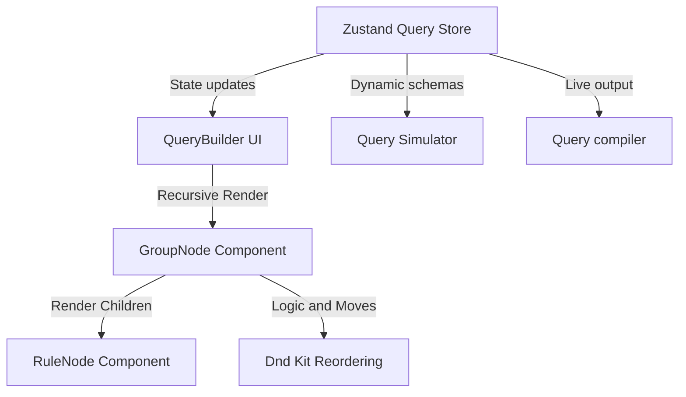

# QueryForge — Visual Query Builder

QueryForge is a high-performance, schema-driven visual query builder built with Next.js, React, TypeScript, and Zustand. It allows developers and non-technical users to build complex database and API queries (generating SQL and MongoDB filters) through an intuitive graphical interface.

---

## 🚀 Key Features

*   **Dynamic Rule Builder**: Context-aware inputs (numbers, dates, dropdowns, and checkboxes) with schema-restricted operators.
*   **Nested Logical Groups**: Support for unlimited nested AND/OR condition groups, collapsible group states, and guide line animations.
*   **Query Compilation**: Real-time compile-to-SQL (with SQL-injection escaping) and compile-to-MongoDB filters.
*   **Query Execution Simulator**: In-memory execution against 250+ mock records for Users, Products, or Orders datasets, featuring column sorting and paginated results.
*   **History & Presets (CRUD)**: Save query states, view query history logs, undo/redo query adjustments, and import/export queries via validated JSON files.
*   **Aesthetic & Interactions**: Built with an elevated material visual style, featuring GSAP cinematic parallax scrolling, interactive card cursor-guided flashlight glow effects, guided entry blur reveals, and premium custom animations.
*   **Validated & Tested**: Safe schema validation, date/number range verification, and 100% test coverage with Vitest.

---

## 🏗️ Architecture & Core Design Decisions



### 1. Normalized State Management (Zustand)
Instead of storing a deeply nested JSON object (which leads to complex recursive tree traversal for minor node updates and triggers global component re-renders), the query tree state is fully **normalized** inside our Zustand store (`src/lib/store.ts`):
*   `groups`: A flat map of group IDs to `Group` structures: `{ id, type, children: (RuleId | GroupId)[], parentId }`.
*   `rules`: A flat map of rule IDs to `Rule` structures: `{ id, field, operator, value, value2 }`.
*   `rootGroupId`: The ID of the root logical group.

**Advantages**:
*   Updating a specific rule's input or field is an `O(1)` state operation, requiring no recursive tree searching.
*   Moving nodes (using Dnd Kit) is simplified to updating children arrays and parent references in the flat records map.
*   It enables **Zustand selectors** to hook components to individual node records, preventing parent re-renders when a nested child changes.

---

## 🔄 Recursive Rendering Strategy

The query tree is rendered recursively by `src/components/QueryBuilder/GroupNode.tsx`:
1.  `GroupNode` receives a `groupId` prop, fetches the corresponding group record from the store, and maps over its `children`.
2.  If a child ID starts with `rule_`, it renders a `<RuleNode id={childId} />`.
3.  If a child ID starts with `group_`, it recursively renders a `<GroupNode id={childId} depth={depth + 1} />`.
4.  A cycle prevention check is executed inside `moveNode` in `src/lib/store.ts` to ensure a parent group can never be dragged inside one of its own descendants.

---

## ⚡ Query Compiler & Compiler Escaping

The query compiler (`src/lib/engine.ts`) compiles the query state recursively by starting at the root group ID:
*   **SQL Generation**: Generates standard SQL filter clauses. To prevent SQL injection in mock fields, all string inputs, enum values, and dates are escaped by replacing single quotes `'` with double single quotes `''`, and wrapped inside safe quotes.
*   **MongoDB Generation**: Generates syntax-valid MongoDB queries. Value types are coerced according to field definitions (e.g. converting string numbers to floats/integers, and string truthy values to real booleans). Supports regex-based queries for text matching (`contains` mapped to `{ $regex: value, $options: 'i' }` and `startsWith` mapped to `{ $regex: ^value, $options: 'i' }`).

---

## 🧪 Testing Suite & Verification

The project is backed by a comprehensive unit and integration testing suite utilizing **Vitest** and **React Testing Library**:
*   **Query Compiler Tests (`engine.test.ts`)**: Verifies SQL string escaping, AND/OR nesting syntax, MongoDB type coercion, and complex operators.
*   **Validation Tests (`validation.test.ts`)**: Asserts type compliance, range validation (such as ensuring end date is after start date), and empty nested group detection.
*   **Store Action Tests (`store.test.ts`)**: Confirms CRUD methods, recursive node deletions, and cycle prevention.
*   **Execution Tests (`executor.test.ts`)**: Validates filtering results of in-memory data for all operators, including date-bounds, lists, and null checks.
*   **UI Integration Tests (`QueryBuilder.test.tsx`)**: Renders components inside JSDOM to test clicks, node creations, operator switching, and DOM element deletion.

### Running the Tests

To execute the test suite in single-run mode:
```bash
npm run test
```

---

## 🛠️ Getting Started

### Prerequisites
*   Node.js 18+
*   npm or yarn

### Installation
1. Install dependencies:
   ```bash
   npm install
   ```

2. Run the development server:
   ```bash
   npm run dev
   ```

3. Build for production:
   ```bash
   npm run build
   ```
